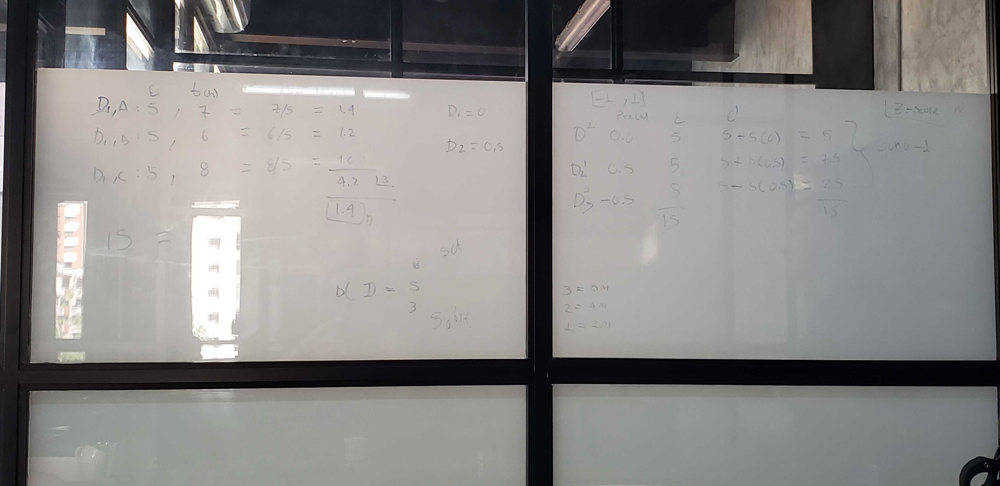

# Pillars for Success

- [Organization](#organization)
- [Metrics](#metrics)
- Discipline
- ???
- [Books](#books)

## Organization

First implement and master on my own, then apply to developers

### Me

- 15 mins before shift to plan what to do and at what times
- ~ 8 hours of productive work hours
  - 0 - 5
    - Development
  - 5 - 7
    - Administrative
    - Reviews
    - 1:1
    - Code reviews
    - How to apply standards
    - etc
  - 7 - 8
    - Help others
    - Other tasks

### Developers

- 1st hour
  - Testing (commit)
- 2nd hour
  - Comment on how to solve story assigned
- Make them estimate their stories based on fibonacci
  - Identify which ones are better at estimates and make those help the ones that are not so good at it

## Metrics

### Development speed

Estimate in fib divided by the # of hours that took to develop = # of hours on average spent on development per fib point.

e.g.:

- D1

  - E = 5
  - t(h) = 7

- D2

  - E = 5
  - t(h) = 6

- D3
  - E = 5
  - t(h) = 8

speed = (5/7) + (5/6) + (5/8) / 3

**Normalize through variation `z-score`**

### Relate tickets related to bugs with the perception of the company

Surveys with clients

### Automate repetitive tasks

Measure how many tasks need to be automated

### **ANYTHING YOU WANT TO IMPLEMENT YOU HAVE TO SELL WITH METRICS**

### Measure devs

- Metrics and surveys

OKR
KPI

# Books

- Mide lo que importa
- Los hombres ons de marte y las mujeres son de venus
- Intimidades masculinas - walter viso
