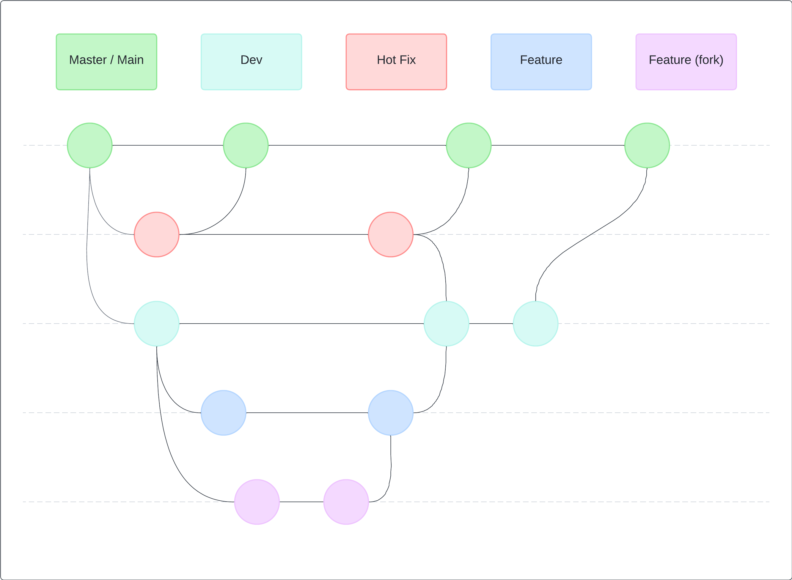

# Branch Flow

**Note:** Developers branch from and make PRs to the `dev` branch and below.

# Development Flow

- We have to use forks for development because of branch permission limitations on GitHub free
- Upstream repositories: [sport-enlace-sas-gannar](https://github.com/orgs/sport-enlace-sas-gannar/repositories)
  - RO for developers
  - Developer to fork the desired repository into their own accounts
  - The default branch is `dev` so that developers **ONLY FORK THIS BRANCH**

## Steps

1.  Go to the JIRA story assigned and create a branch through the ticket (this creates a branch with the story identifier in the upstream repository - will be used to merge into after story development - e.g.: `GAN-188`)
2.  Create a new branch `foo` from your fork's `dev` branch to develop the story
3.  Develop the story on branch `foo`
4.  When you're done developing the story
    - **SQUASH MERGE** into your fork's `dev` branch (to keep the upstream repository's commit history clean)
    - Commit with a message starting with the identifier of the story (e.g.: `git commit -m "GAN-188: ..."`)
5.  Make a PR to merge your fork's `dev` branch into the upstream's story branch created from JIRA in step 1 (e.g.: `GAN-188`)
6.  Once the PR is accepted and merged
    - Delete branch `foo` on your fork
    - Sync your fork with upstream
7.  Rinse and repeat
